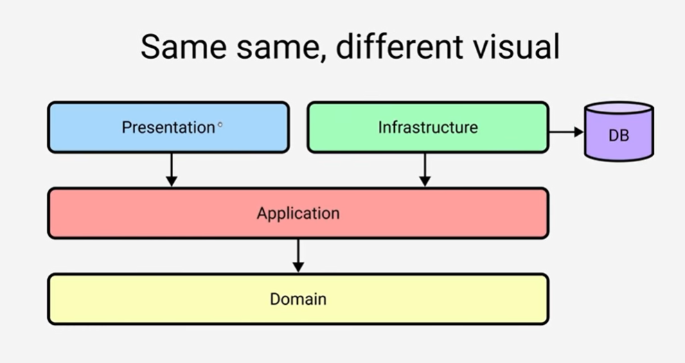
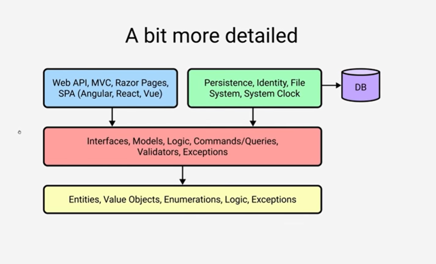
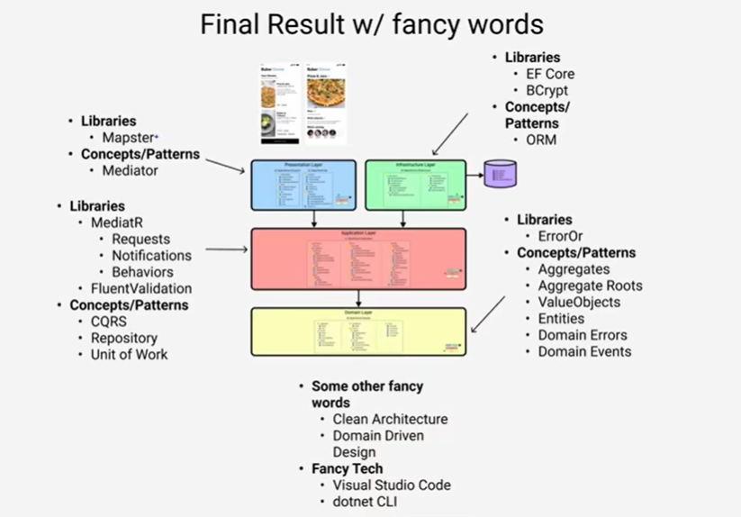

## .NET Project using Clean architecture with DDD principles

### Clean Architecture Layers

- Presentation
  - API
  - Contracts
- Infrastructure
- Application
- Domain

### Commands
- `dotnet new sln -o DinnerHost`
- `cd DinnerHost/`
- `dotnet new webapi -o DinnerHost.API`
- `dotnet new classlib -o DinnerHost.Contracts`
- `dotnet new classlib -o DinnerHost.Infrastructure`
- `dotnet new classlib -o DinnerHost.Application`
- `dotnet new classlib -o DinnerHost.Domain`
- `dotnet sln add $(ls -r **/*.csproj)`
- `dotnet add DinnerHost.API/ reference DinnerHost.Contracts/ DinnerHost.Application/`
- `dotnet add DinnerHost.Infrastructure/ reference DinnerHost.Application/`
- `dotnet add DinnerHost.Application/ reference DinnerHost.Domain/`
- Theoritically infra is independent from the API. But make infra reachable to API project to register it's own dependencies: `dotnet add DinnerHost.API/ reference DinnerHost.Infrastructure/`
- Remove proj reference from infra like this: `dotnet remove DinnerHost.Infrastructure/ reference DinnerHost.API/DinnerHost.API.csproj` 
- Build the solution: `dotnet build`
- Run the project: `dotnet run --project DinnerHost.API`

### Visualize clean architecture
```
----------------------------------
Presentation ↓ | Infrastructure ↓ -> DB
----------------------------------
         Application ↓
----------------------------------
            Domain
----------------------------------
```

<!-- 



 -->

### Used tools
- REST Client: to run the .http commands inside the file

